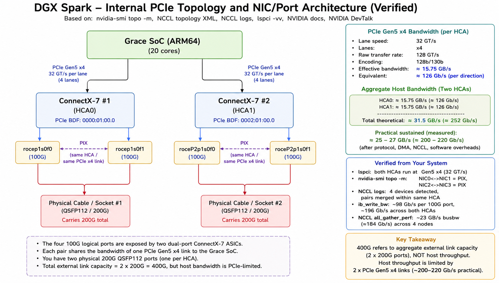

# Overview

This repository documents the deployment, validation, troubleshooting,
and performance testing of a 4-node NVIDIA DGX Spark cluster connected
across a multi-switch topology.

# DGX Spark Specs
The DGX Spark is built on the NVIDIA GB10 Grace Blackwell Superchip. Its CPU is a 20-core Arm Grace processor (10 Cortex-X925 performance cores and 10 Cortex-A725 efficiency cores). The Grace CPU and Blackwell GPU are joined by NVLink-C2C, a wide, cache-coherent chip-to-chip interconnect (~900 GB/s class) that gives both a single unified memory space, so instead of the slower PCIe link and separate memory pools of a normal PC, there is no copy bottleneck and the GPU can address the full 128 GB of unified memory, letting these boxes hold much larger models than the raw GPU memory alone would allow.
On the networking side, the external I/O comes from two dual-port ConnectX-7 NICs (HCA0 and HCA1), each connected to the Grace SoC over its own PCIe Gen5 x4 link. Each HCA has two 100G ports that share its single PCIe Gen5 x4 link. Each Gen5 x4 link max throughput is ~126 Gb/s per direction, so two HCAs give roughly ~252 Gb/s in theory, and with different overheads the sustained rate is about 200–220 Gb/s. Below diagram shows the internal connectivity architecture  of a DGX-Spark machine.
  
                                                                           

# Hardware
- 4 × NVIDIA DGX Spark
- NVIDIA ConnectX-7 Adapters (Dual 200G Ports per Node)
- Multi-Switch Topology (Juniper PTX10002-36QDD)

# Physical Topology
```bash
                   +----------------+
                   |    Switch-1    |
                   +----------------+
                    |  |  ||     |  |
                    |  |  ||     |  |
                    |  |  ||     |  |
                  DGX-01  ||     DGX-02
  NIC0: 192.168.100.10    ||       NIC0: 192.168.100.11
  NIC1: 192.168.101.10    ||       NIC1: 192.168.101.11
                          ||
                    Inter-Switch Link
                          ||
                          ||
                   +----------------+
                   |    Switch-2    |
                   +----------------+
                    |  |        |  |
                    |  |        |  |
                    |  |        |  |
                   DGX-03          DGX-04
  NIC0: 192.168.100.12               NIC0: 192.168.100.13
  NIC1: 192.168.101.12               NIC1: 192.168.101.13
```

# Implementation and Validation Workflow

We have brought up the cluster  with following sequence
* DGX-Sparks Nodes Physical bring and mgmt access (not recorded here)
* IP connectivity between Spark  Nodes and underlay switching fabric
* Spark Nodes discovery and SSH Authentication key setup
* Infra validation
* Perfornabce Validation
   * RDMA Write Operation (without NCCL Testing)
   * NCCL Performance Testing 


## Implementation Workflow
### Configure Netplan

**DGX-01**

```bash
sudo tee /etc/netplan/40-cx7.yaml >/dev/null <<'EOF'
network:
  version: 2
  ethernets:
    enp1s0f0np0:
      addresses:
        - 192.168.100.10/24
      dhcp4: no
      mtu: 9216

    enP2p1s0f0np0:
      addresses:
        - 192.168.101.10/24
      dhcp4: no
      mtu: 9216
EOF

sudo netplan generate
sudo netplan apply
```

**DGX-02**

```bash
sudo tee /etc/netplan/40-cx7.yaml >/dev/null <<'EOF'
network:
  version: 2
  ethernets:
    enp1s0f0np0:
      addresses:
        - 192.168.100.11/24
      dhcp4: no
      mtu: 9216

    enP2p1s0f0np0:
      addresses:
        - 192.168.101.11/24
      dhcp4: no
      mtu: 9216
EOF

sudo netplan generate
sudo netplan apply
```

**DGX-03**

```bash
sudo tee /etc/netplan/40-cx7.yaml >/dev/null <<'EOF'
network:
  version: 2
  ethernets:
    enp1s0f0np0:
      addresses:
        - 192.168.100.12/24
      dhcp4: no
      mtu: 9216

    enP2p1s0f0np0:
      addresses:
        - 192.168.101.12/24
      dhcp4: no
      mtu: 9216
EOF

sudo netplan generate
sudo netplan apply
```

**DGX-04**

```bash
sudo tee /etc/netplan/40-cx7.yaml >/dev/null <<'EOF'
network:
  version: 2
  ethernets:
    enp1s0f0np0:
      addresses:
        - 192.168.100.13/24
      dhcp4: no
      mtu: 9216

    enP2p1s0f1np1:
      addresses:
        - 192.168.101.23/24
      dhcp4: no
      mtu: 9216
EOF

sudo netplan generate
sudo netplan apply
```

## NCCL Build

```bash
git clone https://github.com/NVIDIA/nccl.git
cd nccl
make -j

git clone https://github.com/NVIDIA/nccl-tests.git
cd nccl-tests
make MPI=1 CUDA_HOME=/usr/local/cuda
```

**Validated:**
- NCCL builds cleanly
- libnccl produced
- nccl-tests build with MPI
- perf binaries produced

## Spark-Nodes Discovery
Before execting any further test sequence , DGX nodes discover and password less SSH among all nodes is required. 

```bash
wget https://raw.githubusercontent.com/NVIDIA/dgx-spark-playbooks/main/nvidia/connect-two-sparks/assets/discover-sparks
```
### Discovery Scripit Execution
```bash
chmod +x discover-sparks 
./discover-sparks
```
**Validated:**

- All nodes are discovered 
- Password less SSH access is setted up 

## Infra Validation 
### Verify IP Addressing

```bash
ip -4 -br a
ip link show |egrep "enp1s0f0np0|enp1s0f1np1|enP2p1s0f0np0|enP2p1s0f1np1" | grep mtu
show_gids | egrep "rocep1s0f0|rocep1s0f1|roceP2p1s0f0|roceP2p1s0f1"
```

**Validated:**

- netplan applied on all four nodes
- MTU 9216 set
- each interface holds its expected IP
- RoCEv2 GIDs present


### Verify RDMA Devices

```bash
rdma link
ibv_devices
ibv_devinfo
ibdev2netdev
```

**Validated:**

- all RoCE devices enumerate
- ports PORT_ACTIVE

### Verify RDMA MTU

Verify if RDMA MTU is set to `4096` and if not then fix it.

```bash
for d in rocep1s0f0 rocep1s0f1 roceP2p1s0f0 roceP2p1s0f1; do   echo "=== $d ===";   ibv_devinfo -d $d | grep active_mtu; done

=== rocep1s0f0 ===
                        active_mtu:             4096 (5)
=== rocep1s0f1 ===
                        active_mtu:             1500 (5)
=== roceP2p1s0f0 ===
                        active_mtu:             4096 (5)
=== roceP2p1s0f1 ===
                        active_mtu:             1500 (5)
```
If any interfaces shows RDMA MTU >4096 then fix it using following commands. 
```bash
sudo ip link set enP2p1s0f1np1 mtu 9216
sudo ip link set enp1s0f1np1 mtu 9216
```

**Validated:**

- active_RDMA_mtu = 4096 on all four devices
- Above test is required to executed on each node 

### Verify MPI Launch

```bash
mpirun -np 4 \
-H 192.168.100.10:1,192.168.100.11:1,192.168.100.12:1,192.168.100.13:1 \
--mca plm_rsh_agent "ssh -o UserKnownHostsFile=/dev/null -o StrictHostKeyChecking=no -x" \
hostname
```
Example Output

```bash
rtme-nvidia-spark-dgx-01
rtme-nvidia-spark-dgx-02
rtme-nvidia-spark-dgx-03
rtme-nvidia-spark-dgx-04
```

**Validated:**

- all four ranks launch
- each hostname returned

### Verify GPU Stack

```bash
nvidia-smi
nvcc --version
```

**Validated:**

- driver and CUDA versions reported
- GPU visible

## Performance Validation   
### Validate Raw RDMA Performance

We need to identify GID of each IB Device 

```bash
show_gids
DEV     PORT    INDEX   GID                                     IPv4            VER     DEV
---     ----    -----   ---                                     ------------    ---     --
ocep1s0f0       1       0       fe80:0000:0000:0000:4ebb:47ff:fe2a:6531                  v1      enp1s0f0np0
rocep1s0f0      1       1       fe80:0000:0000:0000:4ebb:47ff:fe2a:6531                 v2      enp1s0f0np0
rocep1s0f0      1       2       0000:0000:0000:0000:0000:ffff:c0a8:640d 192.168.100.13          v1      enp1s0f0np0
rocep1s0f0      1       3       0000:0000:0000:0000:0000:ffff:c0a8:640d 192.168.100.13          v2      enp1s0f0np0
rocep1s0f1      1       0       fe80:0000:0000:0000:4ebb:47ff:fe2a:6532                 v1      enp1s0f1np1
rocep1s0f1      1       1       fe80:0000:0000:0000:4ebb:47ff:fe2a:6532                 v2      enp1s0f1np1
roceP2p1s0f0    1       0       fe80:0000:0000:0000:4ebb:47ff:fe2a:6535                 v1      enP2p1s0f0np0
roceP2p1s0f0    1       1       fe80:0000:0000:0000:4ebb:47ff:fe2a:6535                 v2      enP2p1s0f0np0
roceP2p1s0f0    1       2       0000:0000:0000:0000:0000:ffff:c0a8:650d 192.168.101.13          v1      enP2p1s0f0np0
roceP2p1s0f0    1       3       0000:0000:0000:0000:0000:ffff:c0a8:650d 192.168.101.13          v2      enP2p1s0f0np0
roceP2p1s0f1    1       0       fe80:0000:0000:0000:4ebb:47ff:fe2a:6536                 v1      enP2p1s0f1np1
roceP2p1s0f1    1       1       fe80:0000:0000:0000:4ebb:47ff:fe2a:6536                 v2      enP2p1s0f1np1
n_gids_found=12
```
Once GID of each IB Device is identified then we can execute  IB_Write operation which gives raw RDMA performance between 2 HCAs on set of DCG Nodes 
**Server (DGX-04)**

```bash
ib_write_bw -d rocep1s0f0 -F --report_gbits -q 8 -s 1048576 -x 3 -p 18515
```

**Client (DGX-04)**

```bash
ib_write_bw -d rocep1s0f0 -F --report_gbits -q 8 -s 1048576 -x 3 -p 18515 192.168.100.13

```
Recorded Results

```bash
#bytes     #iterations    BW peak[Gb/sec]    BW average[Gb/sec]
1048576    40000          98.04              98.04
```

Above  test can be repeated for any pair of DGX Spark. Description of each parameter is given in below table.

| **Parameter** | **Description**              |
|---------------|------------------------------|
| -d rocep1s0f1 | RoCE Interface               |
| -F            | Ignore CPU Frequency Warning |
| –report_gbits | Show Gbps                    |
| -q 8          | 8 Queue Pairs                |
| -s 1048576    | 1 MB Message                 |
| -x 3          | 3 GID of ID Device           |

**Validated:**

- ~98 Gb/s sustained
- 8 QPs connect
- line-rate confirmed

**Full Mesh IB_Write Test**
```bash
cat > full_mesh_ib_wr.sh <<'EOF'
#!/bin/bash
#
# Sequential full-mesh RDMA bandwidth validation using ib_write_bw.
# Every node communicates with every other node.
#

NODES=(192.168.100.10 192.168.100.11 192.168.100.12 192.168.100.13)

DEV=rocep1s0f0
PORT=1
GID=3              # RoCEv2 GID index
SIZE=1048576       # 1 MiB message
SSH="ssh -o StrictHostKeyChecking=no"

for srv in "${NODES[@]}"; do
  for cli in "${NODES[@]}"; do
    [ "$srv" = "$cli" ] && continue

    echo
    echo "=== Server: $srv   Client: $cli ==="

    $SSH "$srv" "ib_write_bw -d $DEV -i $PORT -F --report_gbits -x $GID -s $SIZE" &
    sleep 2

    $SSH "$cli" "ib_write_bw -d $DEV -i $PORT -F --report_gbits -x $GID -s $SIZE $srv" \
      | tee "result_${srv}_${cli}.txt"

    wait
    sleep 1
  done
done

echo
echo "Full-mesh RDMA bandwidth validation completed."
EOF
```
Execute the above script 

``bash
chmod +x full_mesh_ib_wr.sh
./full_mesh_ib_wr.sh
```

### NCCL Testing 
#### NCCL Environment Variables

Now we will execute NCCL Validation test but before going into scripit we will understand all the required parameters and variables.  

**Environment Variables Used**

| Parameter / Variable | Value | Description |
|----------------------|-------|-------------|
| LD_LIBRARY_PATH | /home/regress/nccl/build/lib:... | Locate NCCL, CUDA and MPI libraries |
| NCCL_SOCKET_IFNAME | enp1s0f1np1 | Interface used for NCCL bootstrap traffic |
| NCCL_IB_GID_INDEX | 3 | Use IPv4 RoCEv2 GID |
| NCCL_IB_DISABLE | 0 | Enable RoCE/RDMA transport |
| NCCL_DEBUG | WARN | NCCL logging level |
| NCCL_MIN_NCHANNELS | 16 | Minimum NCCL channels |
| NCCL_MAX_NCHANNELS | 16 | Maximum NCCL channels |
| NCCL_ALGO          | Ring | Tree and Graph can be also be used|

**MPI Parameters**

| **Parameter**            | **Example**          |                                           |
|--------------------------|----------------------|-------------------------------------------|
| mpirun                   | mpirun               | Launch distributed processes              |
| -np                      | 4                    | Number of MPI ranks                       |
| -H                       | 192.168.100.11:1,... | Hosts participating in test               |
| --bind-to none           | N/A                  | Disable CPU pinning                       |
| --mca plm_rsh_agent      | ssh ...              | Remote launch mechanism                   |
| --mca btl tcp,self       | tcp,self             | MPI transport                             |
| --mca btl_tcp_if_include | enp1s0f1np1          | MPI data interface                        |
| --mca oob_tcp_if_include | enp1s0f1np1          | MPI control interface    
| -x VARIABLE              | -x NCCL_IB_GID_INDEX | Pass environment variable to remote nodes |

**NCCL Test Parameters**

| **Parameter**   | **Example**    |                       |
|-----------------|----------------|-----------------------|
| all_gather_perf | NCCL benchmark | Runs AllGather test   |
| -b              | 512M           | Starting message size |
| -e              | 4G             | Ending message size   |
| -f              | 2              | Double size each step |
| -g              | 1              | GPUs per MPI rank     |
| -n              | 100            | Iterations per size   |

**Stable Configuration**

```bash
export LD_LIBRARY_PATH=/home/regress/nccl/build/lib:/usr/local/cuda/lib64:/usr/lib/aarch64-linux-gnu/openmpi/lib
export UCX_NET_DEVICES=enp1s0f0np0
export NCCL_SOCKET_IFNAME=enp1s0f0np0
export OMPI_MCA_btl_tcp_if_include=enp1s0f0np0
export NCCL_ALGO=Ring

export NCCL_IB_DISABLE=0
export NCCL_DEBUG=WARN
export NCCL_MIN_NCHANNELS=16
export NCCL_MAX_NCHANNELS=16
```

#### NCCL Collective Tests

 **AllGather 2 Nodes**
```bash
mpirun -np 2 \
  -H 192.168.100.10:1,192.168.100.11:1 \
  --mca plm_rsh_agent "ssh -o UserKnownHostsFile=/dev/null -o StrictHostKeyChecking=no -x" \
  -x LD_LIBRARY_PATH \
  -x UCX_NET_DEVICES \
  -x NCCL_SOCKET_IFNAME \
  -x NCCL_MIN_NCHANNELS \
  -x NCCL_MAX_NCHANNELS \
  -x OMPI_MCA_btl_tcp_if_include \
  -x NCCL_ALGO \
  $HOME/nccl-tests/build/all_gather_perf -b 1024M -e 4G -f 2 -g 1 -n 100
```
***Result*** 
```bash
Max BusBW = 24.06 GB/s 
Avg BusBW = 22.02 GB/s
```
**AllGather 4 Nodes** 
```bash
mpirun -np 4 \
  -H 192.168.100.10:1,192.168.100.11:1,192.168.100.12:1,192.168.100.13:1 \
  --mca plm_rsh_agent "ssh -o UserKnownHostsFile=/dev/null -o StrictHostKeyChecking=no -x" \
  -x LD_LIBRARY_PATH \
  -x UCX_NET_DEVICES \
  -x NCCL_SOCKET_IFNAME \
  -x NCCL_MIN_NCHANNELS \
  -x NCCL_MAX_NCHANNELS \
  -x OMPI_MCA_btl_tcp_if_include \
  -x NCCL_ALGO \
  $HOME/nccl-tests/build/all_gather_perf -b 1024M -e 4G -f 2 -g 1 -n 100
```
***Result*** 
```bash
Max BusBW = 22.47 GB/s
Avg BusBW = 21.41 GB/s 
```

**AllReduce 2 Nodes**
```bash
mpirun -np 2 \
  -H 192.168.100.10:1,192.168.100.11:1 \
  --mca plm_rsh_agent "ssh -o UserKnownHostsFile=/dev/null -o StrictHostKeyChecking=no -x" \
  -x LD_LIBRARY_PATH \
  -x UCX_NET_DEVICES \
  -x NCCL_SOCKET_IFNAME \
  -x NCCL_MIN_NCHANNELS \
  -x NCCL_MAX_NCHANNELS \
  -x OMPI_MCA_btl_tcp_if_include \
  -x NCCL_ALGO \
  $HOME/nccl-tests/build/all_gather_perf -b 1024M -e 4G -f 2 -g 1 -n 100
```
***Result*** 
```bash
Max BusBW = 24.24 GB/s 
Avg BusBW = 24.1 GB/s
```
**AllReduce 4 Nodes** 
```bash
mpirun -np 4 \
  -H 192.168.100.10:1,192.168.100.11:1,192.168.100.12:1,192.168.100.13:1 \
  --mca plm_rsh_agent "ssh -o UserKnownHostsFile=/dev/null -o StrictHostKeyChecking=no -x" \
  -x LD_LIBRARY_PATH \
  -x UCX_NET_DEVICES \
  -x NCCL_SOCKET_IFNAME \
  -x NCCL_MIN_NCHANNELS \
  -x NCCL_MAX_NCHANNELS \
  -x OMPI_MCA_btl_tcp_if_include \
  -x NCCL_ALGO \
  $HOME/nccl-tests/build/all_reduce_perf -b 1024M -e 4G -f 2 -g 1 -n 100
```
***Result*** 
```bash
Max BusBW = 23.66 GB/s 
Avg BusBW = 23.35 GB/s
```
**AlltoAll 2 Nodes**
```bash
mpirun -np 2 \
  -H 192.168.100.10:1,192.168.100.11:1 \
  --mca plm_rsh_agent "ssh -o UserKnownHostsFile=/dev/null -o StrictHostKeyChecking=no -x" \
  -x LD_LIBRARY_PATH \
  -x UCX_NET_DEVICES \
  -x NCCL_SOCKET_IFNAME \
  -x NCCL_MIN_NCHANNELS \
  -x NCCL_MAX_NCHANNELS \
  -x OMPI_MCA_btl_tcp_if_include \
  -x NCCL_ALGO \
  $HOME/nccl-tests/build/alltoall_perf -b 1024M -e 4G -f 2 -g 1 -n 100
```
***Result*** 
```bash
Max BusBW = 19.82 GB/s
Avg BusBw = 19.65 GB/s
```

**AlltoAll 4 Nodes** 
```bash
mpirun -np 4 \
  -H 192.168.100.10:1,192.168.100.11:1,192.168.100.12:1,192.168.100.13:1 \
  --mca plm_rsh_agent "ssh -o UserKnownHostsFile=/dev/null -o StrictHostKeyChecking=no -x" \
  -x LD_LIBRARY_PATH \
  -x UCX_NET_DEVICES \
  -x NCCL_SOCKET_IFNAME \
  -x NCCL_MIN_NCHANNELS \
  -x NCCL_MAX_NCHANNELS \
  -x OMPI_MCA_btl_tcp_if_include \
  -x NCCL_ALGO \
  $HOME/nccl-tests/build/alltoall_perf -b 1024M -e 4G -f 2 -g 1 -n 100
```
***Result*** 
```bash
Max BusBW = 16.55 GB/s
Avg BusBW = 15.61 GB/s 
```

**ReduceScatter 2 Nodes**
```bash
mpirun -np 2 \
  -H 192.168.100.10:1,192.168.100.11:1 \
  --mca plm_rsh_agent "ssh -o UserKnownHostsFile=/dev/null -o StrictHostKeyChecking=no -x" \
  -x LD_LIBRARY_PATH \
  -x UCX_NET_DEVICES \
  -x NCCL_SOCKET_IFNAME \
  -x NCCL_MIN_NCHANNELS \
  -x NCCL_MAX_NCHANNELS \
  -x OMPI_MCA_btl_tcp_if_include \
  -x NCCL_ALGO \
  $HOME/nccl-tests/build/alltoall_perf -b 1024M -e 4G -f 2 -g 1 -n 100
```
***Result*** 
```bash
Max BusBw = 22.89 GB/s
Avg BusBW = 22.14 GB/s
```

**ReduceScatter 4 Nodes** 
```bash
mpirun -np 4 \
  -H 192.168.100.10:1,192.168.100.11:1,192.168.100.12:1,192.168.100.13:1 \
  --mca plm_rsh_agent "ssh -o UserKnownHostsFile=/dev/null -o StrictHostKeyChecking=no -x" \
  -x LD_LIBRARY_PATH \
  -x UCX_NET_DEVICES \
  -x NCCL_SOCKET_IFNAME \
  -x NCCL_MIN_NCHANNELS \
  -x NCCL_MAX_NCHANNELS \
  -x OMPI_MCA_btl_tcp_if_include \
  -x NCCL_ALGO \
  $HOME/nccl-tests/build/reduce_scatter_perf -b 1024M -e 4G -f 2 -g 1 -n 100
```
***Result*** 
```bash
Max BusBW = 23.94 GB/s
Avg BusBW = 23.29 GB/s 
```


**Validated:**

- AllGather, AllReduce, AllToAll, ReduceScatter completed
- correct results

#### Collective Summary

| Collective    | Nodes | Max BusBw GB/s | Avg BusBw GB/s |
|---------------|-------|----------------|----------------|
| AllGather     | 2     | 24.06          | 22.02          |
| AllGather     | 4     | 22.47          | 21.41          |
| AllReduce     | 2     | 24.24          | 24.1           |
| AllReduce     | 4     | 23.66          | 23.35          |
| AlltoAll      | 2     | 19.82          | 19.65          |
| AlltoAll      | 4     | 16.55          | 15.61          |
| ReduceScatter | 2     | 22.89          | 22.14          |
| ReduceScatter | 4     | 23.94          | 23.29          |


#### Traffic Monitor

Monitor traffic:

```bash
watch ethtool -S enp1s0f1np1
cat /sys/class/net/enp1s0f1np1/statistics/rx_bytes
cat /sys/class/net/enp1s0f1np1/statistics/tx_bytes
```

Validated:

- Expected Interface Usage
- Byte Counters Increasing
- NCCL Traffic Placement

# Future Work

- PyTorch DDP
- FSDP
- DeepSpeed
- Megatron-LM
- vLLM
- Distributed Training
- Disaggregated Inference
- Agentic AI
- Multi-node LLM Serving
