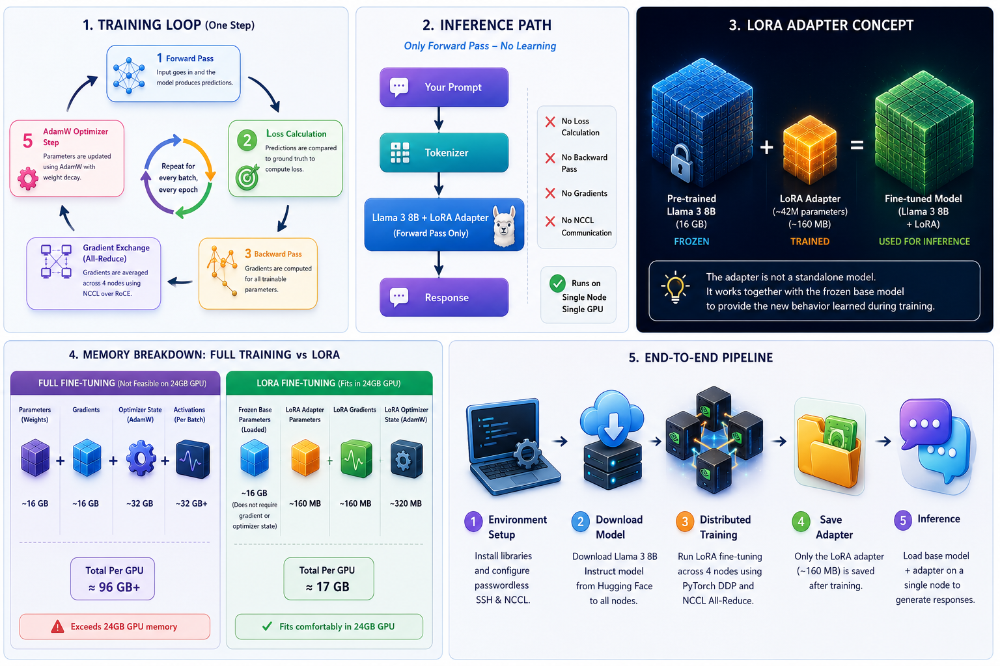
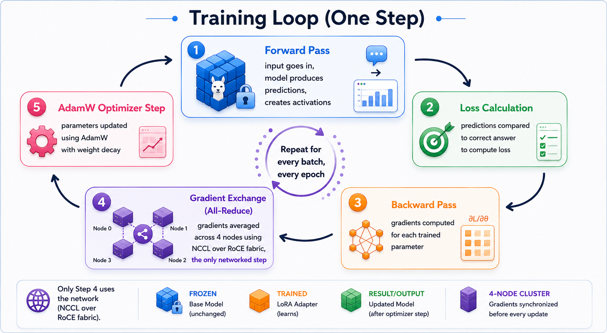
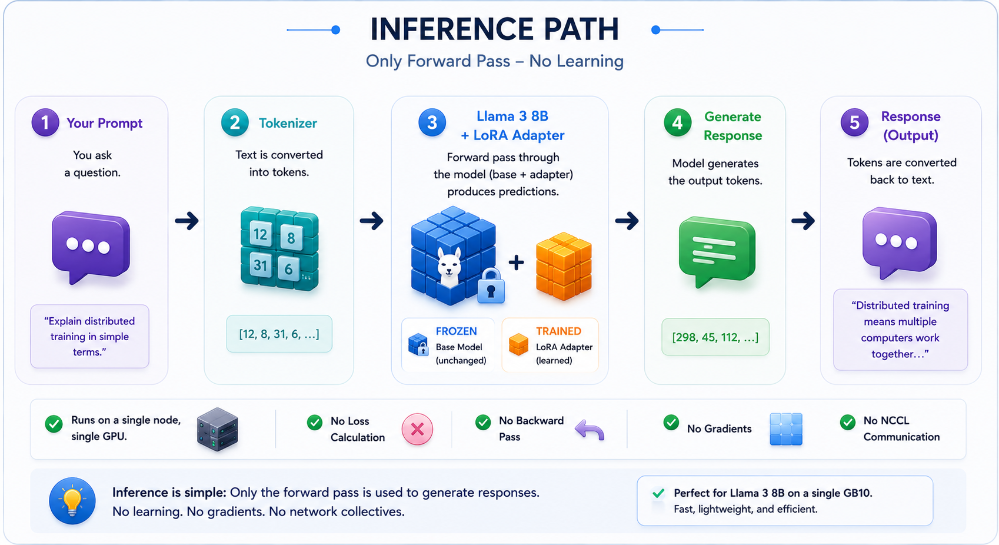
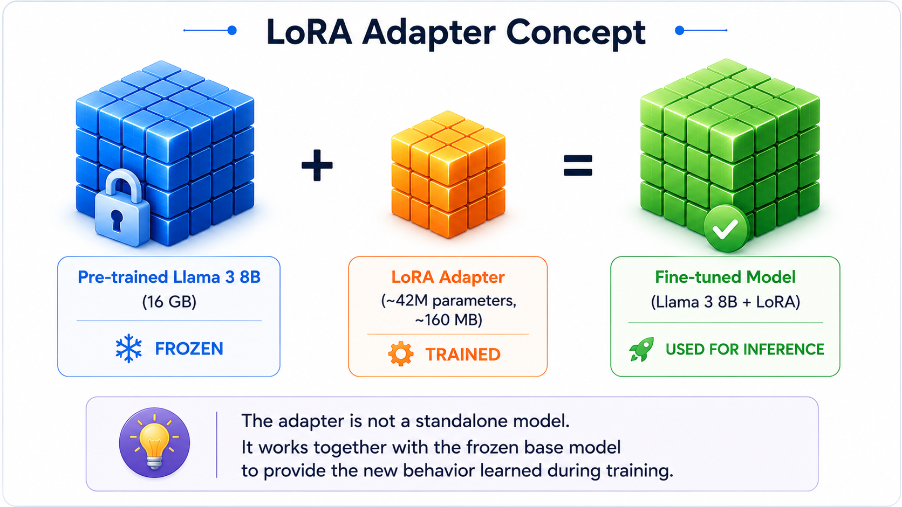
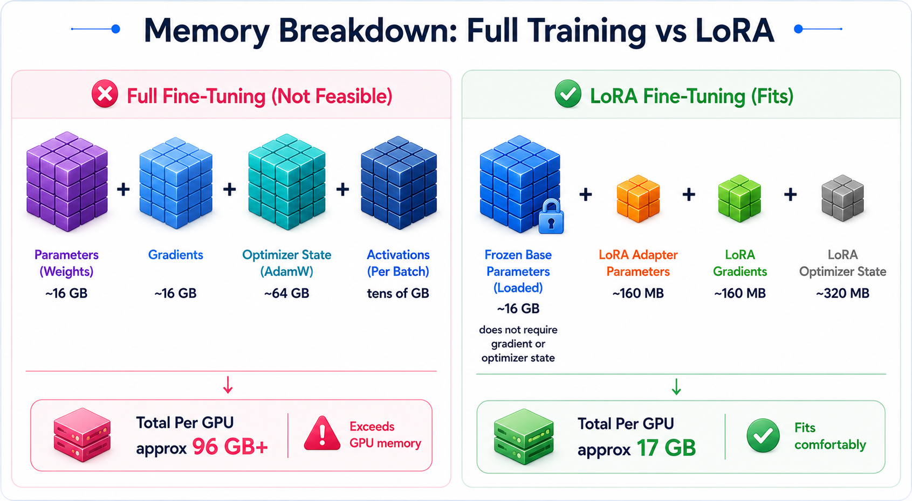
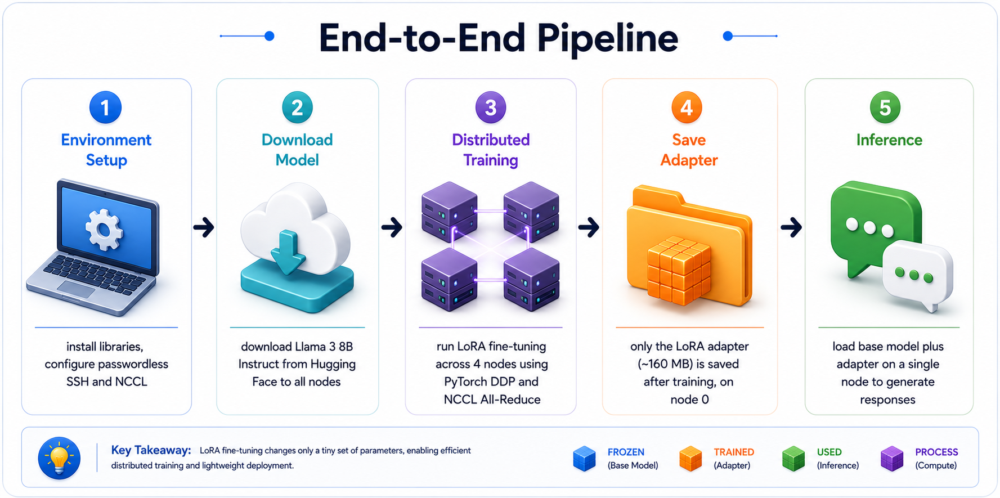
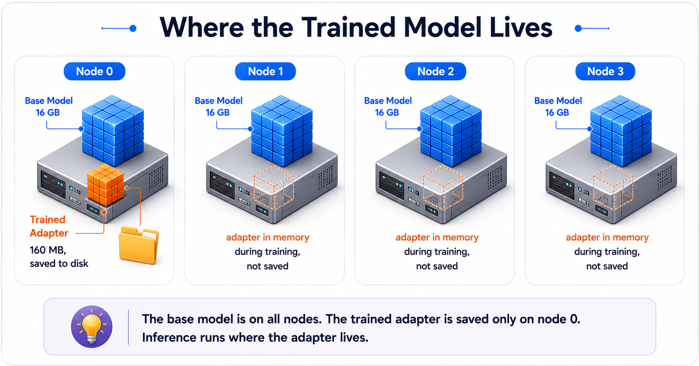

# Multi-Node LoRA Fine-Tuning of Llama 3 8B on a 4-Node DGX Spark Cluster

The previous documents covered cluster setup, NCCL performance testing, and a simple multi node training job on synthetic data. This guide extends that work to fine-tuning a production large language model, Llama 3 8B, across all 4 nodes. The entire workflow runs without a job scheduler and without shared storage, using only the 4 DGX Spark nodes.

Prerequisites:

- Cluster setup is complete. [DGX-Spark 4 Nodes Cluster Setup](https://github.com/kashif-nawaz/DGX-Spark/tree/main/Cluster-Setup)
- The simple training job guide is complete. [Simple Training Job](https://github.com/kashif-nawaz/DGX-Spark/tree/main/simple_training_job)
- Working knowledge of Linux.
- Basic working knowledge of Python. No Python needs to be written; the scripts are created by pasting prepared blocks.
- Working knowledge of NCCL collective operations.

Every abbreviation is expanded on first use and collected in the Glossary at the end.

## Overview
This guide demonstrates two distinct activities: training a model and running inference with it. They are different operations with different requirements, and understanding the difference is the foundation for everything that follows. The summary above shows the full picture at a glance; the sections that follow explain each part.



###  Training

Training is the process of teaching the model. It runs the same short cycle repeatedly, once per batch of examples, and each cycle is called a training step. A single step has five parts.



**Forward pass.** The model reads an input example and produces an answer. While doing so it generates intermediate results called activations, which are held in memory because they are needed later in the same step.

**Loss calculation.** The model's answer is compared to the correct answer from the training data. The difference is reduced to a single number called the loss, which measures how wrong the answer was. A high loss means the answer was poor. A low loss means it was close.

**Backward pass.** Working backward from the loss, the model computes a gradient for every trained parameter. A gradient is a value that indicates the direction to adjust that parameter so the answer is less wrong next time.

**Gradient exchange.** This step exists only in multi-node training. Each of the four nodes has computed gradients from its own different data. Before any node updates its parameters, the nodes average their gradients together so they all apply the same update and remain identical. This averaging is performed by NCCL using an all-reduce collective over the RoCE fabric. It is the only step that uses the network.

**Optimizer step.** The optimizer, AdamW, uses each gradient together with its stored optimizer state to update the parameter slightly. AdamW is explained in the next paragraph. Once this step completes, the step is finished and the next one begins.

AdamW is the component that performs the actual parameter updates. Its name comes from Adaptive Moment Estimation with Weight Decay. In practical terms, it does two useful things beyond a naive update. First, it adapts the update size for each individual parameter based on the recent history of that parameter's gradients, so parameters that need large moves get large moves and stable parameters get small ones. Second, it applies a gentle pull toward smaller values, called weight decay, which helps prevent the model from over-fitting to the training data. To do this it keeps two bookkeeping numbers per trained parameter, which is why the optimizer is a significant consumer of memory, as shown later in the memory section.

### Pre-Training and Fine-tuning
A model like Llama 3 8B is built in two stages.
**Pre-Training** Pre-training is the first and much larger stage, done by the model's creator. The model reads an enormous amount of general text and learns language, facts, and reasoning from scratch. This needs huge datasets and large clusters running for weeks, at very high cost. The result is the base model downloaded from Hugging Face. Pre-training is not repeated here; the finished base model is the starting point.
**Fine-Tuning** Fine-tuning is the second, much smaller stage, and is what this guide performs. It takes the already pre-trained model and adjusts it on a small, focused dataset so its behaviour shifts toward a desired style or task. It is fast and inexpensive by comparison, minutes rather than weeks, because the model already knows language and only needs nudging.
In short, pre-training builds general ability from nothing, and fine-tuning specialises it. This guide only fine-tunes.

### Training Data
Fine-tuning needs examples to learn from. This guide uses Dolly, a public dataset of about 15,000 human-written question and answer pairs, published by Databricks and general in topic. A small slice of 2,000 examples is used to keep the first run short.
The dataset is what decides what the model learns, because the model moves toward the pattern in the examples it is shown. Since Dolly is general and the slice is small, the result is a shift in the model's answering style rather than new factual knowledge. Training on a different dataset, in the same question and answer format, is how the model would be pointed at a specific domain.

### Completion of Training 

The five-step cycle repeats for every batch in the dataset, and the whole dataset can be passed through more than once. Each full pass over the dataset is called an epoch. As the steps accumulate, the loss trends downward, which is the visible sign that the model is improving. The model is considered trained when this process finishes, at which point its learned values are saved to disk. In this guide, that saved result is the adapter, described below.

### Inference 

Inference is using the finished model to answer questions. It is much simpler than training because it performs only the first step of the cycle, the forward pass. An input goes in, the model runs forward, and an answer comes out. There is no loss calculation, no backward pass, no gradient exchange, and no optimizer step, because nothing is being learned. The model is only being used.



This simplicity has a practical consequence. Training is heavy and benefits from all four nodes working together. Inference is light and runs on a single node. Because Llama 3 8B fits comfortably on one GB10, inference here uses one node, one GPU, and no collective communication at all. A collective such as all-gather or all-reduce would only be needed if a model were too large for a single GPU and had to be split across several, which is not the case here.

### Low-Rank Adaptation (LoRA)

The model in this guide is not trained in full. It is trained using LoRA, which stands for Low-Rank Adaptation. LoRA leaves the original 8 billion parameters of Llama 3 8B frozen and unchanged, and instead trains a small set of new parameters, about 42 million, called an adapter. The adapter is the only part that learns, and it is what gets saved. It is small, about 160 MB, compared to the 16 GB base model.



The adapter is not a standalone model. It cannot answer anything on its own. It is a small layer that sits on top of the frozen base model. At inference, both are loaded together. The base model supplies the general language ability it already had, and the adapter supplies the new behaviour learned during training. Combined, they form the working fine-tuned model. This is why the base model must still be present at inference time, and why the trained result is only the small adapter rather than a full copy of the model.

##  Memory and the Hardware Constraint

The reason LoRA is used, rather than full training, comes down to memory. This is the single most important point in the guide.

Training memory is not limited to the model itself. As the training loop shows, several items must reside in memory at once, and they are linked. Every trainable parameter has a corresponding gradient tensor, and every gradient needs optimizer state. So the total memory bill is driven by the number of parameters that are trained.



The table below shows the approximate cost of fully training all 8 billion parameters, and the meaning of each item.

| Item | Approximate size | Description |
| --- | --- | --- |
| Parameters | 16 GB | The 8 billion model numbers, stored in a compact 2 byte format called bfloat16 (bf16). 8 billion multiplied by 2 bytes is about 16 GB. |
| Gradients | 16 GB | One value per trained parameter indicating the direction to adjust it. Same count as the parameters, so the same size. |
| Optimizer state | 64 GB | AdamW stores two bookkeeping numbers per trained parameter in a larger 4 byte format called float32 (fp32). 8 billion multiplied by 2 numbers multiplied by 4 bytes is about 64 GB. |
| Activations | tens of GB | Temporary intermediate results produced during the forward pass. |

The total for full training is roughly 96 GB before activations, on a machine that must also run its operating system. A DGX Spark node provides 128 GB of memory shared between the processor and the graphics processing unit (GPU). Full training is therefore not feasible with a plain approach.

LoRA removes almost all of this cost. Because the original parameters are frozen, they have no gradients and no optimizer state. Only the small adapter has gradients and optimizer state. The training footprint drops from roughly 96 GB to little more than the 16 GB of frozen parameters, which fits on a single DGX Spark node.

This produces a useful simplification. Because the workload fits on one node, no model-splitting technique is required. The same method from the previous guide applies: Distributed Data Parallel (DDP), in which every node holds a full copy of the frozen model plus its own copy of the small adapter, and the nodes exchange only the small adapter updates. This is the largest simplification for a first production run.

## End-to-End Workflow

Putting the two activities together, the workflow has five stages. The first three prepare the dataset  and train the model. The last two stages produce and use the trained model.



1. Environment setup, on all four nodes.
2. Model access and download, on all four nodes.
3. LoRA fine-tuning, across all four nodes, using the fabric for gradient exchange.
4. The trained adapter is saved, on node 0.
5. Inference, on a single node, combining the base model and the adapter.

Stage 3 is the only stage that uses the RoCE fabric and NCCL. Stage 5 runs the finished model on a single node and requires no distributed setup.

### Implementation and Testing 
## Cluster Details

Substitute local values wherever a placeholder appears.

| Placeholder | Description | Example value |
| --- | --- | --- |
| `MASTER_IP` | Internet Protocol (IP) address of node 0 on the management network reachable by all nodes. This is not the RoCE fabric address. Node 0 coordinates the group. | `x.x.151.249` |
| `NODE2_IP`, `NODE3_IP`, `NODE4_IP` | IP addresses of the other three nodes, used only for copying files with `scp`. | `x.x.151.250`, `.251`, `.252` |
| `NCCL_HCA` | Name of the RoCE port NCCL should use, the same port validated earlier. | `rocep1s0f1` |
| `USER` | Linux username on the nodes. | `regress` |

> The 4 machines are referred to as node 0, node 1, node 2, and node 3.
> Node 0 is the master that coordinates the group.
> Each node receives its own rank number through `--node_rank` (0 on node 0, 1 on node 1, 2 on node 2, 3 on node 3).

### Library installation

Perform on all 4 nodes.

The Python virtual environment (`venv`) and PyTorch were installed in the previous guide. Activate that environment and add the libraries required here.

```
# Activate the environment from the previous guide.
# The prompt should then begin with (train)
source ~/venvs/train/bin/activate

# Install the libraries required for model training.
#   transformers      : loads and runs the Llama model
#   datasets          : downloads the training data
#   accelerate        : manages the training loop
#   peft              : provides LoRA (Parameter Efficient Fine Tuning)
#   huggingface_hub   : login and model download
pip install transformers datasets accelerate peft huggingface_hub
```

Confirm the libraries import cleanly on each node.

```
python -c "import transformers, datasets, accelerate, peft; print('all good')"
```

The expected result is `all good` on all four nodes.

> If a later training run fails immediately with `ModuleNotFoundError: No module named 'datasets'`, the installation did not complete in the active environment. Re-run the installation and re-check with the import test.

### Model access

Llama 3 is a gated model. The publisher, Meta, requires acceptance of a license before download. This is a one time task performed in a browser.

1. Create a free account at Hugging Face, the site that hosts the model. Hugging Face is the primary public repository for machine learning models and datasets.
2. Open the model page for `meta-llama/Meta-Llama-3-8B-Instruct` and accept the license. Approval typically arrives by email within minutes to a few hours. Download is blocked until approval is granted.
3. Create an access token. A token is a long secret string beginning with `hf_`. It acts as a password that authorizes download of the gated model. Create it under Settings, then Access Tokens, with Read permission.

> Treat the token as a password. Do not place it in documents and do not commit it to a repository.

### Model download

Perform on all 4 nodes.

With no shared storage, every node requires its own copy of the model, approximately 15 GB.

```
# Log in with the token. Paste the hf_... string when prompted.
# The characters do not display while pasting, which is expected.
# Answer n if prompted about git credentials.
hf auth login

# Download the model to the node's local cache.
# The download uses the node's own internet connection, not the workstation.
# The --exclude flag skips an unused raw format, saving several GB.
hf download meta-llama/Meta-Llama-3-8B-Instruct --exclude "original/*"
```

Confirm the download on each node.

```
# Reports approximately 15 GB when complete.
du -sh ~/.cache/huggingface/hub/models--meta-llama--Meta-Llama-3-8B-Instruct
```

> If a download stops partway, re-run the same `hf download` command. It resumes from the interruption point rather than restarting.

### Training script

Paste the following block on node 0. It creates a file named `train_lora_llama.py`. Each section is commented.

```
cat > ~/train_lora_llama.py << 'EOF'
import os
import torch
import torch.distributed as dist
from datasets import load_dataset
from transformers import (
    AutoModelForCausalLM, AutoTokenizer,
    DataCollatorForLanguageModeling, Trainer, TrainingArguments,
)
from peft import LoraConfig, get_peft_model

# The model to fine-tune, and the folder where the trained adapter is saved.
MODEL_ID = "meta-llama/Meta-Llama-3-8B-Instruct"
OUTPUT_DIR = os.path.expanduser("~/llama3-lora-dolly")

def is_main_process():
    # True only on node 0. Ensures only one node prints and saves.
    return int(os.environ.get("RANK", "0")) == 0

def main():
    # Each DGX Spark has one GPU, so the local GPU index is 0.
    local_rank = int(os.environ.get("LOCAL_RANK", "0"))
    torch.cuda.set_device(local_rank)

    # The tokenizer converts text into numbers the model reads, and back again.
    tokenizer = AutoTokenizer.from_pretrained(MODEL_ID)
    # Llama has no dedicated padding token, so the end of sequence token is reused.
    tokenizer.pad_token = tokenizer.eos_token

    # Load the full model in bfloat16, placed on this node's GPU.
    # Each node loads its own full copy.
    model = AutoModelForCausalLM.from_pretrained(
        MODEL_ID, torch_dtype=torch.bfloat16, device_map={"": local_rank},
    )
    model.config.use_cache = False

    # Attach the LoRA adapter. These settings control the adapter size.
    #   r          : adapter width. Larger means more capacity and more memory.
    #   lora_alpha : scaling factor applied to the adapter.
    #   target_modules : which internal parts of the model receive an adapter.
    lora = LoraConfig(
        r=16, lora_alpha=32, lora_dropout=0.05, bias="none", task_type="CAUSAL_LM",
        target_modules=["q_proj","k_proj","v_proj","o_proj",
                        "gate_proj","up_proj","down_proj"],
    )
    model = get_peft_model(model, lora)
    if is_main_process():
        # Prints the number of trainable parameters versus the total.
        model.print_trainable_parameters()

    # Load a small slice of a public dataset of question and answer pairs.
    # train[:2000] takes the first 2000 examples for a quick first run.
    ds = load_dataset("databricks/databricks-dolly-15k", split="train[:2000]")

    # Reformat each example into the chat layout Llama 3 expects.
    def format_example(ex):
        user = ex["instruction"] if not ex.get("context") else f'{ex["instruction"]}\n\n{ex["context"]}'
        text = ("<|begin_of_text|><|start_header_id|>user<|end_header_id|>\n\n"
                f'{user}<|eot_id|><|start_header_id|>assistant<|end_header_id|>\n\n'
                f'{ex["response"]}<|eot_id|>')
        return {"text": text}

    ds = ds.map(format_example, remove_columns=ds.column_names)
    # Convert the text into numbers, capping length to control memory.
    ds = ds.map(lambda ex: tokenizer(ex["text"], truncation=True, max_length=1024),
                remove_columns=["text"])
    collator = DataCollatorForLanguageModeling(tokenizer=tokenizer, mlm=False)

    # Training settings, described after the script.
    args = TrainingArguments(
        output_dir=OUTPUT_DIR,
        per_device_train_batch_size=1,
        gradient_accumulation_steps=8,
        num_train_epochs=1,
        learning_rate=2e-4,
        bf16=True,
        gradient_checkpointing=True,
        logging_steps=10,
        save_strategy="no",
        report_to="none",
        ddp_find_unused_parameters=False,
    )

    trainer = Trainer(model=model, args=args, train_dataset=ds, data_collator=collator)
    trainer.train()

    # Save only the small adapter, on node 0.
    if is_main_process():
        model.save_pretrained(OUTPUT_DIR)
        tokenizer.save_pretrained(OUTPUT_DIR)
        print(f"LoRA adapter saved to {OUTPUT_DIR}", flush=True)

    if dist.is_initialized():
        dist.destroy_process_group()

if __name__ == "__main__":
    main()
EOF
```

### Training Variables 

- `per_device_train_batch_size=1` processes one example at a time per node, keeping memory low.
- `gradient_accumulation_steps=8` collects the learning signal from 8 examples before updating the adapter, providing the effect of a larger batch without the memory cost.
- `num_train_epochs=1` makes one full pass over the 2000 examples.
- `bf16=True` uses the bfloat16 format, which the Blackwell GPU processes efficiently.
- `gradient_checkpointing=True` saves memory by recomputing some intermediate results during the backward pass instead of storing them, trading additional computation for lower memory use.
- `save_strategy="no"` disables intermediate saves. The finished adapter, approximately 160 MB, is saved explicitly at the end.

### Script Distribution

Run on node 0. Substitute the addresses and username.

```
scp ~/train_lora_llama.py USER@NODE2_IP:~/
scp ~/train_lora_llama.py USER@NODE3_IP:~/
scp ~/train_lora_llama.py USER@NODE4_IP:~/
```

### Launch

The static launch style from the previous guide applies here. Every node waits until all four are present before any node begins, which avoids the partial group condition described in Troubleshooting.

The RoCE port is set with a separate `export` line before launch. Placing it on its own line, rather than inline with the long command, prevents it from being dropped if the command wraps or is partly truncated during paste. This condition is documented in Troubleshooting.

Run the two `export` lines followed by the launch command on each node. Only `--node_rank` changes between nodes.

Node 0:

```
export NCCL_IB_HCA=rocep1s0f1
export NCCL_DEBUG=WARN
torchrun \
  --nnodes=4 \
  --nproc_per_node=1 \
  --node_rank=0 \
  --master_addr=x.x.151.249 \
  --master_port=29500 \
  train_lora_llama.py
```

Node 1: identical, with `--node_rank=1`.

Node 2: identical, with `--node_rank=2`.

Node 3: identical, with `--node_rank=3`.

> The port setting can be confirmed before launch with `echo $NCCL_IB_HCA`, which should print `rocep1s0f1`.

### Results

Only node 0 prints progress. The other three nodes run silently, which is correct.

```
trainable params: 41,943,040 || all params: 8,072,204,288 || trainable%: 0.5196
{'loss': '2.079', ... 'epoch': '0.16'}
{'loss': '1.733', ... 'epoch': '0.32'}
{'loss': '1.708', ... 'epoch': '0.48'}
{'loss': '1.623', ... 'epoch': '0.64'}
{'loss': '1.622', ... 'epoch': '0.80'}
{'loss': '1.659', ... 'epoch': '0.96'}
{'train_runtime': '241.4', 'train_samples_per_second': '8.286', 'train_loss': '1.737', 'epoch': '1'}
LoRA adapter saved to /home/USER/llama3-lora-dolly
```

> Expect a pause of one to two minutes at the start while each node loads approximately 15 GB of model into memory. The program appears idle during this period but is not.

### Interpreting the output

Each part of the output confirms a specific result.

**Trainable parameters line.**

```
trainable params: 41,943,040 || all params: 8,072,204,288 || trainable%: 0.5196
```

This line confirms LoRA is active. It contains three numbers:

- `all params: 8,072,204,288` is the total model size, approximately 8 billion parameters. This is the complete Llama 3 8B model.
- `trainable params: 41,943,040` is the number of parameters actually trained, approximately 42 million. These are the adapter parameters. Everything else is frozen.
- `trainable%: 0.5196` is the first number divided by the second, approximately half of one percent. Half a percent of the model is trained; the remaining 99.5 percent is untouched. This small fraction is why the job fits in memory and runs quickly.

**Loss.**

The loss is a measure of how incorrect the model's answers are, so lower is better. Over the run it fell from 2.079 to the 1.6 range. A falling loss indicates genuine learning from the data. This contrasts with the previous guide, where the data was random noise and the loss did not fall. Here the data consists of real question and answer pairs, so a real pattern exists to learn.

**Runtime and throughput.**

`train_runtime: 241.4` indicates the run took approximately 4 minutes. `train_samples_per_second: 8.286` is the throughput across the cluster. This is the first production training performance figure for the cluster.

**Saved adapter.**

`LoRA adapter saved to ...` confirms node 0 wrote the result to disk.

### Trained Model 

This point is worth stating clearly, because it is a common source of confusion. The base model, approximately 16 GB, is present on all four nodes, because it was downloaded to each node. The trained adapter, approximately 160 MB, is present on node 0 only, because the script saves it only there. During training all four nodes held identical adapter values in memory, but only node 0 wrote them to disk.



| | Node 0 | Nodes 1, 2, 3 |
| --- | --- | --- |
| Base model, 16 GB | present | present |
| Trained adapter, 160 MB | saved to disk | not saved |

The consequence is that inference must run on node 0, where the adapter resides. To run inference on a different node, copy the adapter there first. The base model is already present on that node, so only the small adapter needs to move.

```
scp -r ~/llama3-lora-dolly USER@NODE2_IP:~/
```

Copying the adapter off node 0 is also a sensible backup, as this small folder is the entire trained result.

### Adapter Inspection

```
ls -lh ~/llama3-lora-dolly
```

The output should include `adapter_model.safetensors` at approximately 160 MB, along with a small configuration file and the tokenizer files. This folder is the fine-tuned result. Combined with the base model, it constitutes the trained model. Its small size is the central benefit of LoRA: the base model remains unchanged, and the custom work is a small file layered on top.

### Inference

Fine-tuning produces a file. It does not by itself provide an interactive model. Querying the model requires the inference step described in the Overview, which runs only the forward pass. In this example, inference runs on a single node with no cluster launch and no NCCL because the full Llama 3 8B model fits on one GB10. Larger models, or inference configurations that intentionally split the model across GPUs, may require NCCL and distributed launch methods.

The script below loads the base model, applies the adapter on top, and then accepts questions in sequence until `quit` is entered. Create it on node 0.

```
cat > ~/chat_lora.py << 'EOF'
import os
import torch
from transformers import AutoModelForCausalLM, AutoTokenizer
from peft import PeftModel

BASE = "meta-llama/Meta-Llama-3-8B-Instruct"
ADAPTER = os.path.expanduser("~/llama3-lora-dolly")

print("Loading model. This takes about 2 minutes the first time.", flush=True)

# Load the tokenizer, the frozen base model, then apply the adapter on top.
tok = AutoTokenizer.from_pretrained(BASE)
model = AutoModelForCausalLM.from_pretrained(BASE, torch_dtype=torch.bfloat16, device_map={"": 0})
model = PeftModel.from_pretrained(model, ADAPTER)
model.eval()

print("Model ready. Enter a question. Type quit to exit.\n", flush=True)

while True:
    q = input("You: ").strip()
    if q.lower() in ("quit", "exit", "q"):
        break
    if not q:
        continue
    # Wrap the question in the chat layout Llama 3 expects.
    prompt = ("<|begin_of_text|><|start_header_id|>user<|end_header_id|>\n\n"
              f"{q}<|eot_id|><|start_header_id|>assistant<|end_header_id|>\n\n")
    inputs = tok(prompt, return_tensors="pt").to(model.device)
    with torch.no_grad():
        out = model.generate(**inputs, max_new_tokens=512, do_sample=True,
                             temperature=0.7, pad_token_id=tok.eos_token_id)
    # Print only the model's answer, without the prompt.
    print("\nModel:", tok.decode(out[0][inputs["input_ids"].shape[1]:], skip_special_tokens=True), "\n")
EOF
```

Run it on node 0. No launch command is required.

```
python ~/chat_lora.py
```

The model loads once, taking approximately 2 minutes, then answers each question within a few seconds. Enter `quit` to stop.

> A small run of 2000 examples over one pass shifts the model's style rather than its factual knowledge. The change relative to the base model is subtle. The objective of this exercise is a working end to end pipeline, not a substantially altered model. A larger dataset and additional passes produce a stronger effect.

## Troubleshooting

The following are the actual issues encountered during this work, with the fix for each. This section is the most valuable part of the guide, as these conditions are not well documented elsewhere.

### Immediate import failure

Message: `ModuleNotFoundError: No module named 'datasets'`.

Cause: the training libraries were not installed in the active environment.

Fix: re-run `pip install transformers datasets accelerate peft`, then confirm with `python -c "import transformers, datasets, accelerate, peft; print('all good')"`.

### Wrong RoCE port

Message: `Call to ibv_modify_qp failed with 22 Invalid argument, on dev rocep1s0f0:1`.

Behavior: the model loads, LoRA attaches, and the data is prepared, then the run fails at the point where the nodes attempt to communicate.

Cause: the launch command was truncated during paste and began with `B_HCA=...` instead of `NCCL_IB_HCA=...`. With the port setting lost, NCCL selected the wrong RoCE port, `rocep1s0f0` instead of the validated `rocep1s0f1`, and that port could not connect.

Fix: set the port on its own line with `export NCCL_IB_HCA=rocep1s0f1` before running `torchrun`, so a wrapped or truncated command cannot drop it. Confirm with `echo $NCCL_IB_HCA`.


### Hostname resolution failure

Message: `The IPv6 network addresses of (node0 name ...) cannot be retrieved`.

Cause: some nodes could not resolve node 0's hostname to an address.

Fix: add `--local-addr=MASTER_IP` on node 0's command so it advertises its plain IP address rather than a name.

### Orphaned processes

A failed run can leave orphaned processes that block the next launch. Before relaunching, run the following on all nodes.

```
pkill -9 -f torchrun; pkill -9 -f train_lora
```

### Messages that are safe to ignore

- `torch_dtype is deprecated`. Cosmetic.
- `NET/IB : rocep1s0f1:1 GID table changed`. The fabric renegotiated during the run. NCCL handled it and training completed.
- The tokenizer note regarding `clean_up_tokenization_spaces`. Cosmetic.


## Summary

Starting from the cluster built in the earlier guides, an 8 billion parameter model was downloaded to each node and fine-tuned across all 4 nodes with LoRA. The loss fell steadily from 2.08 to the 1.6 range in approximately 4 minutes, a 160 MB adapter was saved on node 0, and the fine-tuned model was queried interactively on a single node. The entire workflow ran with no job scheduler and no shared storage, on 4 DGX Spark nodes.

## Next steps

Two natural extensions follow: training on a larger data slice for additional passes to produce a stronger and more visible effect, and deploying an always-on inference server so the model answers requests over a network interface rather than through a single-process script.

## Glossary

- **Activations.** Temporary intermediate results the model produces during the forward pass. They consume memory during training.
- **AdamW.** The optimizer used in this guide, named for Adaptive Moment Estimation with Weight Decay. It adapts the update size per parameter based on recent gradient history and applies weight decay to reduce over-fitting. It stores two bookkeeping numbers per trained parameter.
- **Adapter.** The small set of new trainable parameters LoRA adds on top of the frozen model, saved as a file of approximately 160 MB. It is not a standalone model; it combines with the base model at inference.
- **all-gather.** A collective operation that gathers pieces from all participants and gives every participant the full set. Used in some multi-GPU inference setups.
- **all-reduce.** A collective operation that combines values from all participants, for example by averaging, and returns the result to every participant. Used for gradient exchange in training.
- **bfloat16 (bf16).** A compact number format using 2 bytes per number. The Blackwell GPU processes it efficiently.
- **Backward pass.** The training step that computes a gradient for each trained parameter by working backward from the loss.
- **DDP (Distributed Data Parallel).** A multi-node training method in which every node holds a full copy of the model, trains on different data, and shares updates with the other nodes.
- **Epoch.** One full pass over the training data.
- **float32 (fp32).** A larger number format using 4 bytes per number. The optimizer bookkeeping is stored in this format.
- **Fine-tuning.** Adjusting an existing model to behave in a desired way by training it on example data.
- **Forward pass.** The step in which the model reads an input and produces an output. It is the only step used during inference.
- **Gradient.** For each trained parameter, a value indicating the direction to adjust it to reduce error.
- **Gradient accumulation.** Collecting the learning signal from several examples before making one update, to approximate a larger batch without additional memory.
- **Gradient checkpointing.** A memory saving technique that recomputes some intermediate results during the backward pass instead of storing them.
- **Gradient exchange.** The training step in which nodes average their gradients over the fabric using all-reduce, so all nodes apply the same update.
- **GPU (Graphics Processing Unit).** The processor that performs the heavy computation for training and inference. On DGX Spark it shares memory with the main processor.
- **Hugging Face.** The primary public repository and hosting site for machine learning models and datasets.
- **Inference.** Running a trained model to produce answers, as distinct from training it. It performs only the forward pass and runs on a single node here.
- **IP (Internet Protocol) address.** The numeric address of a machine on the network.
- **LoRA (Low-Rank Adaptation).** The lightweight fine-tuning method used here. It freezes the original model and trains only a small adapter.
- **Loss.** A measure of how incorrect the model's answers are. Training reduces it.
- **NCCL (NVIDIA Collective Communications Library).** The library that enables GPUs on different nodes to exchange data during training.
- **Optimizer.** The component that updates the model parameters during training. See AdamW.
- **Optimizer step.** The training step in which AdamW updates each parameter using its gradient and optimizer state.
- **Parameter.** A trainable number in the model. Also called a weight. Llama 3 8B has approximately 8 billion parameters.
- **PEFT (Parameter Efficient Fine Tuning).** The family of methods, including LoRA, that train only a small part of a model. Also the name of the software library installed here.
- **RoCE (RDMA over Converged Ethernet).** The high speed network technology carrying the data GPUs exchange. RDMA stands for Remote Direct Memory Access.
- **Token.** In text processing, a small unit of text the model reads as one item. For Hugging Face, a token is the secret string that authorizes downloads.
- **Tokenizer.** The component that converts text into tokens the model reads, and back again.
