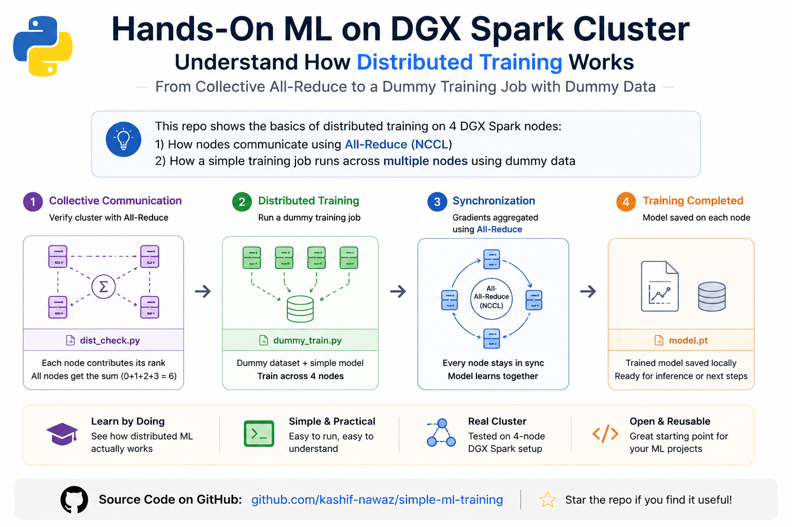

# Multi-Node Model Training on a DGX Spark Cluster — Beginner Guide

In the previous document I have described, how to setup DGX Sparks 4 Nodes cluster across multiswitch topology. 
We have also learned how to perform NCCL performance testing using various collectives. In this guide we will learn how to perform a simple training job on 4 Nodes NVIDIA DGX Spark (GB10 Grace-Blackwell) cluster.

It assumes:

- Cluster setup is completed. [DGX-Spark 4 Nodes Cluster Setup](https://github.com/kashif-nawaz/DGX-Spark/tree/main/Cluster-Setup)
- Reader has working knowladge of Linux. 
- Reader has working knowladge python. 
- Reader has working knowladge of NCCL Collective Operations. [NCCL Collective Operations](https://www.linkedin.com/pulse/what-every-network-engineer-needs-know-ai-traffic-technical-nawaz--eujxc/?trackingId=taRMzXp%2FQ364WD6kqwB2hw%3D%3D)


---

## Cluster Details 

Before proceeding to next section  , let's discover the cluster environment.
guide you see a placeholder, swap in your real value.

| Placeholder in this guide | What it means | Example value |
|---|---|---|
| `MASTER_IP` | The IP address of **node 0** on the network all nodes can reach (management / SSH network, NOT the RoCE fabric). This one node coordinates the others. | `x.x.151.249` |
| `NODE2_IP`, `NODE3_IP`, `NODE4_IP` | IPs of the other three nodes, used only for copying files with `scp`. | `x.x.151.250`, `.251`, `.252` |
| `NCCL_HCA` | The name of the RoCE port NCCL should use | `rocep1s0f1` |
| `USER` | Linux username on the nodes. | `regress` |

**How to find `MASTER_IP` (run this on node 0):**

```bash
# Lists every network interface and its IP.
# Pick out of band  management  network address
ip -4 -br addr show
```

> Throughout this guide, the 4 machines are called **node 0, node 1, node 2, node 3**.
> Node 0 is the "master" that coordinates the group.
> Each node is required to assign it's own rank  i.e `--node_rank` (0 on node 0, 1 on node 1, 2 on node 2, 3 on node 3).

---

## Install Python tooling and PyTorch (Perform this task on ALL 4 nodes)

DGX Spark uses an ARM64 CPU (`aarch64`) with a Blackwell GPU that needs **CUDA 13**.
Normal PyTorch downloads will NOT work as DGX Spark requires  specific  `cu130` package
index shown below.

### Check  basics (optional sanity check, run on each node)

```bash
# Confirms  the ARM64 architecture and it Should print: aarch64
uname -m

# Confirms the CUDA version the driver supports and look for "CUDA Version: 13.0"
nvidia-smi
```

### Create an isolated Python environment (a "venv")

A venv is a private sandbox for Python packages so they don't conflict with the
system packages. On each node this virtual environment is required to be created.

```bash
# on each of node 02, 03, 04
python3 -m venv ~/venvs/train && source ~/venvs/train/bin/activate
```
### Install PyTorch (the CUDA 13 / ARM64 build)
```bash
pip install --upgrade pip
pip install torch torchvision torchaudio --index-url https://download.pytorch.org/whl/cu130
python -c "import torch; print(torch.__version__, torch.cuda.is_available())"
```


### Verify PyTorch sees the GPU (run on each node)

```bash
# Prints: the torch version, the CUDA version, True, and the GPU name.
python -c "import torch; print(torch.__version__, torch.version.cuda, torch.cuda.is_available(), torch.cuda.get_device_name(0))"
```

Expected output (numbers may differ slightly):

```
2.12.1+cu130 13.0 True NVIDIA GB10
```

> Note on warning messages:
> `Found GPU0 NVIDIA GB10 which is of cuda capability 12.1 ... supported ... (8.0) - (12.0)`
> **This is safe to ignore.** GB10 works fine despite the warning.

**Repeat all of Section 1 on every one of the 4 nodes.** Keep the PyTorch version
identical on all nodes — mismatched versions cause hangs.

---

## Sanity-check the cluster BEFORE real training

Before proceeding to  model training, let's ensure that all 4 nodes can talk to each other and do a
group math operation (an "all-reduce"). This catches network problems early.

### Create the check script (run on ALL 4 nodes)

Since there is no shared storage, create the file on each node separately.
Paste this ENTIRE block. It creates a file called `dist_check.py` .

```bash

cat > dist_check.py <<'EOF'
# This tiny program verifies that PyTorch Distributed (NCCL) is working.
#
# All four nodes join one communication group. Each node contributes its
# rank number (0, 1, 2, 3), and NCCL performs an all-reduce SUM operation.
#
# Expected result:
#   0 + 1 + 2 + 3 = 6
#
# If everything is working correctly, every node should print:
#   rank X/4 all_reduce result = 6.0

import os
import torch
import torch.distributed as dist

# Initialize the distributed process group using the NCCL backend.
# This establishes communication between all participating nodes.
dist.init_process_group(backend="nccl")

# Get this process's global rank (0..3) and the total number of processes.
rank = dist.get_rank()
world = dist.get_world_size()

# Each DGX Spark has one GPU, so LOCAL_RANK is always 0.
# Tell PyTorch which GPU this process should use.
torch.cuda.set_device(int(os.environ["LOCAL_RANK"]))

# Create a GPU tensor containing this node's rank value.
# Rank 0 -> tensor([0])
# Rank 1 -> tensor([1])
# Rank 2 -> tensor([2])
# Rank 3 -> tensor([3])
t = torch.ones(1, device="cuda") * rank

# Perform an all-reduce SUM across all nodes.
# After this call, every node receives the same result.
#
# Before:
#   Rank 0 : 0
#   Rank 1 : 1
#   Rank 2 : 2
#   Rank 3 : 3
#
# After:
#   Rank 0 : 6
#   Rank 1 : 6
#   Rank 2 : 6
#   Rank 3 : 6
dist.all_reduce(t)

# Display the result on every node.
print(f"rank {rank}/{world} all_reduce result = {t.item()}", flush=True)

# Leave the distributed communication group cleanly.
dist.destroy_process_group()
EOF
```

### Launch the check on all 4 nodes

Run these in 4 terminals (one per node). **Only `--node_rank` changes.**
Replace `MASTER_IP` and `NCCL_HCA` with your values.

The flags explained:
- `--nnodes=4` : total number of machines.
- `--nproc_per_node=1` : GPUs per machine (DGX Spark has 1 GPU each).
- `--node_rank=N` : THIS node's number. 0, 1, 2, or 3.
- `--master_addr` / `--master_port` : where node 0 listens so others can find it.
  (Port 29500 is arbitrary; any free port works, just use the same one everywhere.)
  
  

**Node 0:**
```bash
NCCL_DEBUG=WARN \
NCCL_IB_HCA=rocep1s0f1 \
torchrun \
  --nnodes=4 \
  --nproc_per_node=1 \
  --node_rank=0 \
  --master_addr=x.x.151.249 \
  --master_port=29500 \
  dist_check.py
```

**Node 1:** 
```bash
NCCL_DEBUG=WARN \
NCCL_IB_HCA=rocep1s0f1 \
torchrun \
  --nnodes=4 \
  --nproc_per_node=1 \
  --node_rank=1 \
  --master_addr=x.x.151.249 \
  --master_port=29500 \
  dist_check.py
```
**Node 2:** 
```bash
NCCL_DEBUG=WARN \
NCCL_IB_HCA=rocep1s0f1 \
torchrun \
  --nnodes=4 \
  --nproc_per_node=1 \
  --node_rank=2 \
  --master_addr=x.x.151.249 \
  --master_port=29500 \
  dist_check.py
```
**Node 3:** 
```bash
NCCL_DEBUG=WARN \
NCCL_IB_HCA=rocep1s0f1 \
torchrun \
  --nnodes=4 \
  --nproc_per_node=1 \
  --node_rank=3 \
  --master_addr=x.x.151.249 \
  --master_port=29500 \
  dist_check.py
```
###  Success Criteria 

Every node prints (the number before the slash is that node's rank):

**Node 0:**
```bash
NCCL version 2.29.7+cuda13.2
rank 0/4 all_reduce result = 6.0
```

**Node 1:**
```bash
rank 1/4 all_reduce result = 6.0
```

**Node 2:**
```bash
rank 2/4 all_reduce result = 6.0
```
**Node 3:**
```bash
rank 3/4 all_reduce result = 6.0
```

In some case , script may hung up.  In that case execute following the following and re-run the script
```bash
pkill -9 -f torchrun; pkill -9 -f dist_check
```

Above results confirm that cluster is validated with following explanation. 
- rank x/4, shows a particular node's rank in the cluster. 
- `/4` — all four nodes joined ONE group.
- `6.0` — the sum across all four ranks is correct.


## Run a real multi-node training job

This example trains a small neural network across four DGX Spark systems using PyTorch Distributed Data Parallel (DDP) with the NCCL backend. 
Each node trains on a different subset of the dataset. 
After every backward pass, DDP automatically performs an all-reduce to synchronize gradients so that all four GPUs maintain identical model weights.

### Create the training script on node 0

Paste this whole block on **node 0**. It writes `train_ddp_spark.py`,
with the checkpoint saved in home folder (since there is no shared storage).

```bash
cat > ~/train_ddp_spark.py << 'EOF'
# Multi-node training with DDP (Distributed Data Parallel).
# Each node holds a full copy of the model, processes different data,
# and after each step the gradients are averaged across all nodes over
# the fabric. This is the standard, simplest form of multi-node training.
import os
import torch
import torch.distributed as dist
import torch.nn as nn
from torch.nn.parallel import DistributedDataParallel as DDP
from torch.utils.data import DataLoader, DistributedSampler, TensorDataset

def main():
    # --- Join the group of all nodes over NCCL/the fabric ---
    dist.init_process_group(backend="nccl")
    local_rank = int(os.environ["LOCAL_RANK"])   # GPU index on THIS node
    global_rank = dist.get_rank()                # this node's ID (0..3)
    world_size = dist.get_world_size()           # total nodes (4)
    torch.cuda.set_device(local_rank)
    device = torch.device("cuda", local_rank)

    # --- The model: a tiny 2-layer network (replace with a real one later) ---
    model = nn.Sequential(
        nn.Linear(1024, 4096), nn.ReLU(), nn.Linear(4096, 10)
    ).to(device)
    # Wrap it so gradients are automatically shared across all nodes.
    model = DDP(model, device_ids=[local_rank])

    # --- Fake dataset (random numbers). Replace with real data later. ---
    x = torch.randn(50000, 1024)
    y = torch.randint(0, 10, (50000,))
    ds = TensorDataset(x, y)

    # DistributedSampler makes sure each node sees a DIFFERENT slice of the data
    # (so they don't all train on the same rows).
    sampler = DistributedSampler(
        ds, num_replicas=world_size, rank=global_rank, shuffle=True
    )

    # num_workers=0 is important on DGX Spark: its memory is shared between CPU
    # and GPU, and extra data-loader workers can exhaust it. Start at 0.
    loader = DataLoader(
        ds, batch_size=64, sampler=sampler, num_workers=0, pin_memory=False
    )

    # --- Optimizer + loss function ---
    opt = torch.optim.AdamW(model.parameters(), lr=1e-3)
    loss_fn = nn.CrossEntropyLoss()

    # --- Training loop: 5 passes over the data ---
    for epoch in range(5):
        sampler.set_epoch(epoch)   # reshuffle each epoch
        model.train()
        for xb, yb in loader:
            xb = xb.to(device, non_blocking=True)
            yb = yb.to(device, non_blocking=True)
            opt.zero_grad()
            loss = loss_fn(model(xb), yb)
            loss.backward()        # gradients averaged across nodes here
            opt.step()
        # Only node 0 prints, to avoid 4 copies of every line.
        if global_rank == 0:
            print(f"epoch {epoch} loss {loss.item():.4f}", flush=True)

    # --- Save the trained weights (only node 0 writes the file) ---
    if global_rank == 0:
        torch.save(model.module.state_dict(), os.path.expanduser("~/ckpt.pt"))
        print("saved checkpoint to ~/ckpt.pt", flush=True)

    dist.destroy_process_group()

if __name__ == "__main__":
    main()
EOF
```

### Copy the script to the other 3 nodes (run on node 0)

Replace the IPs and `USER` with your values.

```bash
# 'scp' copies a file to another machine over SSH.
scp ~/train_ddp_spark.py username@x.x.151.250:~/
scp ~/train_ddp_spark.py username@x.x.151.251:~/
scp ~/train_ddp_spark.py username@x.x.151.252:~/
```

### Launch training on all 4 nodes

Exact same pattern as the check, only the script name at the end changes.
**Only `--node_rank` differs between nodes.**

**Node 0:**
```bash
  
NCCL_DEBUG=WARN \
NCCL_IB_HCA=rocep1s0f1 \
torchrun \
  --nnodes=4 \
  --nproc_per_node=1 \
  --node_rank=0 \
  --master_addr=x.x.151.249 \
  --master_port=29500 \
  train_ddp_spark.py
```
**Node 1:**
```bash
NCCL_DEBUG=WARN \
NCCL_IB_HCA=rocep1s0f1 \
torchrun \
  --nnodes=4 \
  --nproc_per_node=1 \
  --node_rank=1 \
  --master_addr=x.x.151.249 \
  --master_port=29500 \
  train_ddp_spark.py
```
**Node 2:**
```bash
NCCL_DEBUG=WARN \
NCCL_IB_HCA=rocep1s0f1 \
torchrun \
  --nnodes=4 \
  --nproc_per_node=1 \
  --node_rank=2 \
  --master_addr=x.x.151.249 \
  --master_port=29500 \
  train_ddp_spark.py
```
**Node 3:**
```
NCCL_DEBUG=WARN \
NCCL_IB_HCA=rocep1s0f1 \
torchrun \
  --nnodes=4 \
  --nproc_per_node=1 \
  --node_rank=3 \
  --master_addr=x.x.151.249 \
  --master_port=29500 \
  train_ddp_spark.py
```
### Outcome 

The distributed training application completed successfully across all four DGX Spark systems using the NCCL backend.

```bash
NCCL version 2.29.7+cuda13.2

epoch 0 loss 2.3498
epoch 1 loss 2.4395
epoch 2 loss 2.3287
epoch 3 loss 2.4334
epoch 4 loss 2.5293

saved checkpoint to ~/ckpt.pt
```

#### Success Criteria

The distributed training completed successfully across all four DGX Spark systems.

- **NCCL version 2.29.7+cuda13.2**
  - Confirms that PyTorch successfully initialized NCCL for distributed GPU communication.

- **Training completed successfully**
  - All four nodes participated in the training job.
  - DDP synchronized gradients across all nodes using **NCCL All-Reduce** after every backward pass.
  - No communication or synchronization errors were observed.

- **Loss values**
  - The loss fluctuates between **2.3** and **2.5** instead of decreasing steadily.
  - This is expected because the training data and labels are randomly generated:

    ```python
    x = torch.randn(...)
    y = torch.randint(...)
    ```

  - Since there is no relationship between the inputs and labels, the model cannot learn meaningful patterns. 
  - The objective of this example is to validate **multi-node distributed training**, not model accuracy.

- **Checkpoint created successfully**
  - Rank 0 saved the trained model to:

    ```text
    ~/ckpt.pt
    ```

#### Verifying the Saved Model

Inspect the checkpoint with:

```bash
python -c "
import torch
sd=torch.load('/home/regress/ckpt.pt')
[print(k, tuple(v.shape)) for k,v in sd.items()]
"
```

Example output:

```text
0.weight (4096, 1024)
0.bias   (4096,)
2.weight (10, 4096)
2.bias   (10,)
```

| Parameter | Shape | Description |
|-----------|----------------|--------------------------------------------|
| `0.weight` | `(4096, 1024)` | First fully connected layer weights |
| `0.bias` | `(4096,)` | First layer bias |
| `2.weight` | `(10, 4096)` | Output layer weights |
| `2.bias` | `(10,)` | Output layer bias |

The checkpoint confirms that:

- The neural network was successfully trained using **Distributed Data Parallel (DDP)**.
- Gradients were synchronized across all four DGX Spark systems using **NCCL All-Reduce**.
- The final model parameters were saved successfully.

> **Note:** This example validates the multi-node DDP infrastructure on DGX Spark. 
            Because the dataset and labels are randomly generated, the loss is not expected to converge. 
            The successful completion of training and creation of the checkpoint demonstrate that distributed training is functioning correctly.
            The loss bouncing around ~2.4 is fine here — the data is random noise. What matters is that all epochs ran and the checkpoint was saved. 
            The machinery works.

---


#### Next step: train on REAL data

The toy run proves the plumbing. To see loss actually go DOWN, you need a real model
and a real dataset (for example, a small Hugging Face model on a real text or image
dataset), plus improvements like `bf16` precision and gradient accumulation. That is
the natural follow-up once this guide's steps all succeed.

#### Next step: train on real data

The toy DDP run validates the distributed training plumbing: PyTorch, NCCL, node launch, gradient synchronization, and checkpoint creation.

The next step is to replace the synthetic random dataset with a real dataset and model. For example:

- Fine-tune a small Hugging Face text model on a real text classification dataset.
- Train a small vision model on an image dataset.
- Enable `bf16` mixed precision if supported.
- Use gradient accumulation to increase the effective batch size without increasing GPU memory usage.
- Track loss and accuracy on a validation dataset.

With real input data and meaningful labels, the training loss should decrease more consistently. 
This follow-up confirms not only that distributed communication works, but that the cluster can run an actual multi-node training workload.
